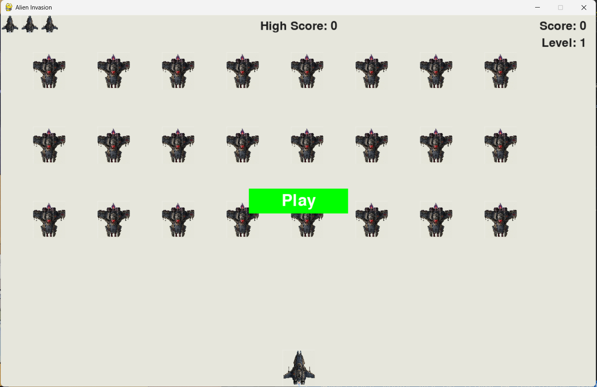

# 👾 Alien Invasion

A classic 2D space shooter game built with Python and Pygame. Defend Earth by shooting down waves of aliens before they reach the bottom of the screen!

---

## 🎮 Gameplay

- Control a spaceship at the bottom of the screen
- Shoot bullets to destroy waves of incoming aliens
- Aliens speed up as you clear each level
- You have 3 lives — don't let aliens reach the bottom or collide with your ship!
- Beat your high score across sessions

---

## 🖼️ Screenshots

## 

---

## 🚀 Getting Started

### Prerequisites

Make sure you have the following installed:

- Python 3.x → [Download](https://www.python.org/downloads/)
- Pygame

### Install Pygame

```bash
pip install pygame
```

### Clone the Repository

```bash
git clone https://github.com/your-username/alien-invasion.git
cd alien-invasion
```

### ⚠️ Image Assets

This game requires two `.bmp` image files placed inside an `image/` folder in the project root:

```
alien-invasion/
│
└── image/
    ├── ship.bmp
    └── alien.bmp
```

> Make sure to update the image paths in `ship.py` and `alien.py` to use a relative path like `'image/ship.bmp'` instead of a hardcoded absolute path before pushing.

### Run the Game

```bash
python Aliens_game.py
```

---

## 🕹️ Controls

| Key | Action |
|-----|--------|
| `→` Arrow | Move ship right |
| `←` Arrow | Move ship left |
| `Space` | Fire bullet |
| `Q` | Quit game |
| Mouse Click | Click **Play** button to start |

---

## 📁 Project Structure

```
alien-invasion/
│
├── Aliens_game.py      # Main entry point — runs the game
├── settings.py         # All game settings (speed, colors, limits)
├── ship.py             # Player ship class
├── alien.py            # Alien class
├── bullet.py           # Bullet class
├── button.py           # Play button UI
├── game_function.py    # Core game logic (events, collisions, rendering)
├── game_stats.py       # Tracks score, level, and lives
├── scoreboard.py       # Renders score, high score, level, and ship icons
│
└── image/
    ├── ship.bmp
    └── alien.bmp
```

---

## ⚙️ Settings Overview

You can tweak gameplay in `settings.py`:

| Setting | Default | Description |
|---------|---------|-------------|
| `screen_width` | 1200 | Game window width |
| `screen_height` | 750 | Game window height |
| `ship_limit` | 3 | Number of lives |
| `bullets_allowed` | 5 | Max bullets on screen |
| `alien_speed_factor` | 0.4 | Starting alien speed |
| `speedup_scale` | 1.1 | Speed increase per level |
| `alien_points` | 5 | Points per alien killed |

---

## 🏆 Scoring

- Each alien is worth **5 points** at the start
- Points **increase with each level** (multiplied by `score_scale = 1.5`)
- Your **high score** is preserved for the entire session

---

## 🛠️ Known Issues / TODOs

- [ ] Image paths are currently hardcoded — update to relative paths before running on another machine
- [ ] High score resets when the game is closed (no file persistence yet)
- [ ] Add sound effects
- [ ] Add a game over screen

---

## 🧰 Built With

- [Python 3](https://www.python.org/)
- [Pygame](https://www.pygame.org/)

---

## 📖 Inspiration

This project is based on the **Alien Invasion** project from the book:  
📘 *Python Crash Course* by **Eric Matthes** — extended with additional features and customizations.

---

## 📄 License

This project is open source and available under the [MIT License](LICENSE).

---

## 🙋‍♂️ Author

**Your Name**  
GitHub: [@Ms-Mirza](https://github.com/Ms-Mirza)
